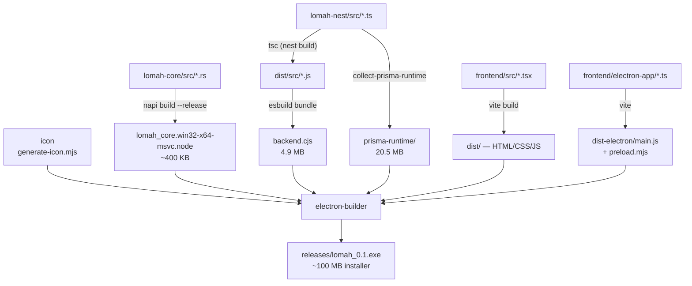

# How LOMAH.exe Gets Built

A beginner's walkthrough of the build: what each piece is, why it exists, and how
three separate source trees — TypeScript, TypeScript, and Rust — end up inside a
single Windows installer.

This is the *build* map. For how the app behaves once it is running, see
[ARCHITECTURE.md](./ARCHITECTURE.md).

---

## 1. The mental model

An Electron app is **a web page and a Node.js program shipped together inside one
executable**. Electron bundles a whole copy of Chromium (the browser engine behind
Chrome) and a whole copy of Node.js. That is why the installer is ~100 MB for what
looks like a small app — most of it is browser, not us.

LOMAH has four moving parts, each written in a different place:

| Part | Lives in | Language | Becomes | Runs as |
|---|---|---|---|---|
| **Renderer** — the UI you look at | `frontend/src` | React + TypeScript | HTML/CSS/JS | A web page, inside Electron's Chromium |
| **Main process** — the desktop shell | `frontend/electron-app` | TypeScript | `main.js` | A Node.js program: owns the window, spawns the backend |
| **Backend** — the API and database | `lomah-nest/src` | NestJS + TypeScript | `backend.cjs` | A separate Node.js process on port 3001 |
| **Native addon** — role + admin election | `lomah-core/src` | **Rust** | `lomah_core….node` | A library loaded *inside* the main process |

> **The Rust is not a separate program.** `lomah-core` compiles to a `.node` file,
> which is a DLL with a Node-shaped front door (the "Node-API" standard). The main
> process `require()`s it and calls its functions like ordinary JavaScript. Same
> `LOMAH.exe`, same process, same window. There is no second executable.

### Why is any of it Rust?

Two jobs have to work **before a backend exists**, because they are what decides
whether a backend gets started at all:

1. **The stored role** — is this tablet the `admin` or a `shooter`?
2. **The admin election** — listen on UDP port 5002 for `LOMAH-ADMIN` beacons and
   find out whether another machine is already the admin.

Both used to be duplicated in JavaScript inside `main.ts`. Two copies of the same
logic drift, and these two had: the JS copy mangled `192.168.1.51:3001` into the
host `"3001"`. Now there is one implementation, in `lomah-core/src/mode.rs` and
`discovery.rs`, and the JavaScript copy is gone.

The election also blocks on a UDP socket for several seconds. In Rust it runs on a
background worker thread, so it never freezes the window.

---

## 2. One command

```bash
npm run electron:build
```

Run from `frontend/`. It expands to five stages, in this order:

```
npm run icon           →  draws build/icon.ico
npm run build:native   →  Rust    →  lomah-core/artifacts/*.node
npm run build:backend  →  NestJS  →  lomah-nest/dist/backend.cjs + prisma-runtime/
npm run build          →  React   →  frontend/dist/
electron-builder       →  packs everything into releases/lomah_0.1.exe
```



Order matters: `electron-builder` only *copies* files. Everything it needs must
already exist, so it runs last.

---

## 3. What each stage actually does

### Stage 1 — `icon`

`scripts/generate-icon.mjs` draws the app icon in code (no image library — it
writes PNG and ICO bytes by hand) and saves `build/icon.ico`.

It is a build *step* rather than a committed image because `build/` is gitignored.
If the icon were missing, electron-builder would not fail — it would quietly ship
the stock Electron icon. Generating it every time removes that trap.

### Stage 2 — `build:native` (the Rust)

```bash
cd lomah-core && napi build --platform --release artifacts
```

`napi` is the build tool for [napi-rs](https://napi.rs), which turns a Rust crate
into a Node addon. It produces three files in `lomah-core/artifacts/`:

- `lomah_core.win32-x64-msvc.node` — the compiled Rust
- `index.js` — a small loader that picks the right `.node` for your platform
- `index.d.ts` — TypeScript types, auto-generated from the Rust doc comments

A fourth file, `package.json` containing `{"type":"commonjs"}`, is stamped by
`scripts/stamp-cjs.mjs`. Section 6 explains why it is not optional.

Rust functions are exposed by annotating them:

```rust
#[napi(js_name = "getStoredMode")]
pub fn get_stored_mode() -> Option<String> { ... }
```

That becomes `core.getStoredMode()` in TypeScript. `frontend/electron-app/native.ts`
loads the addon and describes its shape to TypeScript in one place.

### Stage 3 — `build:backend` (the NestJS API)

Four sub-steps, and the order is load-bearing:

1. **`prisma generate`** — reads `prisma/schema.prisma` and generates the database
   client code.
2. **`nest build`** — runs `tsc`, the real TypeScript compiler, producing
   `dist/src/*.js`.
3. **`esbuild`** — bundles those files into one 4.9 MB `dist/backend.cjs`.
4. **`collect:prisma`** — copies the parts of Prisma that must stay real files.

**Why compile with `tsc` and *then* bundle, instead of pointing the fast bundler at
the TypeScript directly?** NestJS uses "dependency injection": you declare what a
class needs in its constructor and Nest supplies it. To do that, Nest reads type
information TypeScript embeds via a feature called `emitDecoratorMetadata`.
**Only `tsc` emits it — esbuild silently drops it.** Skip `tsc` and every injected
class fails at runtime with *"Nest can't resolve dependencies"*. So esbuild only
ever sees JavaScript that already has the metadata baked in.

Bundling replaces ~25 MB of `node_modules` with a single file.

**Why Prisma is copied instead of bundled.** Its database engine is a native
`.dll.node` loaded from a real path on disk, and the generated client reads
`schema.prisma` off disk next to itself. Neither survives being inlined. So
`collect-prisma-runtime.mjs` copies just the 10 files actually used into
`prisma-runtime/` (20.5 MB) — an **allowlist**, not a filter, because a deny-list
silently regains weight every time Prisma adds files. A full Prisma install is
285 MB.

### Stage 4 — `build` (the React UI)

`vite build` compiles React/TypeScript/Tailwind into plain browser files in
`frontend/dist/`. The same Vite run also compiles `electron-app/main.ts` and
`preload.ts` into `dist-electron/`, because `vite.config.ts` includes
`vite-plugin-electron`.

### Stage 5 — `electron-builder`

Reads the `"build"` block in `package.json` and assembles the installer. Two
different mechanisms, and the difference matters:

- **`files`** → packed into **`app.asar`**, a single archive Electron reads
  directly (think of a .zip it can run from). This is `main.js`, `preload.mjs`
  and the UI.
- **`extraResources`** → copied as **plain files and folders** next to the asar.

```json
"extraResources": [
  { "from": "../lomah-nest/dist/backend.cjs",  "to": "app/backend/backend.cjs" },
  { "from": "../lomah-nest/prisma-runtime",    "to": "app/backend/node_modules" },
  { "from": "../lomah-nest/prisma/migrations", "to": "app/backend/prisma/migrations" },
  { "from": "../lomah-nest/.env.production",   "to": "app/backend/.env" },
  { "from": "lomah-core/artifacts",            "to": "app/native" },
  { "from": "dist",                            "to": "app/dist" }
]
```

Finally it wraps the folder into an NSIS installer: `releases/lomah_0.1.exe`.

---

## 4. What the installed app looks like

```
LOMAH/
├── LOMAH.exe                  ← Electron: Chromium + Node.js + our asar (~230 MB)
├── *.dll, *.pak, locales/     ← Chromium's own resources
└── resources/
    ├── app.asar               ← main.js + preload.mjs + the UI (1.6 MB)
    └── app/
        ├── dist/              ← the UI again, as loose files (see below)
        ├── native/
        │   ├── lomah_core.win32-x64-msvc.node   ← THE RUST
        │   ├── index.js
        │   └── package.json   ← {"type":"commonjs"} — see §6
        └── backend/
            ├── backend.cjs    ← the whole NestJS API, one file
            ├── .env
            ├── node_modules/  ← only Prisma's 10 runtime files
            └── prisma/migrations/
```

The UI appears twice on purpose. In **admin** mode the backend serves it over
`http://127.0.0.1:3001`. In **shooter** and **first-run picker** modes there is no
local backend, so the window loads the files straight from disk — which is why
they must also exist loose, not only inside the asar.

---

## 5. What happens when you double-click it

1. **Single-instance lock** — a second launch just focuses the first window.
2. **`app.setName("LOMAH")`** — pins the data folder to `%APPDATA%\LOMAH`. Change
   that string and every install looks like it lost its history.
3. **Ask the Rust for the role:** `core.getLaunchMode() ?? core.getStoredMode()`
   — a `--role=admin` command-line flag first, then `lomah-mode.json`.
4. **No role yet** (fresh install) → show the **role picker**. No backend, no
   firewall rules, no role claimed until someone chooses. Two tablets powered on
   together must not both silently decide they are admin.
5. **Shooter** → skip the backend entirely and talk to the admin over the network.
6. **Admin** → add firewall rules, then **claim the admin role**:
   - `core.startDiscovery(~5000, true)` listens for a rival's beacon. The `true`
     means "ignore my own beacons" — without it a tablet hears itself and demotes
     itself to shooter on every restart.
   - If a rival answers → dialog: *"Join as Shooter"* or *"Quit"*.
   - Otherwise **spawn the backend** and wait for `/health`.
   - Then listen *once more* for 1.5s, because if two tablets booted at the same
     instant neither was beaconing during the first check.
7. **Open the window** on `http://127.0.0.1:3001/`.

One neat detail in step 6: the backend is started with
`spawn(process.execPath, …, { env: { ELECTRON_RUN_AS_NODE: "1" } })`.
`process.execPath` is `LOMAH.exe` itself — that flag tells Electron *"start as
plain Node.js this time"*. The app reuses the Node.js already inside Electron
instead of shipping a second `node.exe`.

---

## 6. Three traps that shaped this build

Each of these fails **silently** or **only when packaged**, which is what makes
them worth knowing.

### The `"type": "module"` trap — twice

`frontend/package.json` says `"type": "module"`. Node decides whether a `.js` file
is modern ESM or older CommonJS by looking at the **nearest `package.json` above
it** — and that search walks up the whole directory tree.

- **The backend** is called `backend.cjs`, not `.js`. The `.cjs` extension forces
  CommonJS regardless of anything above it. As `.js` it would be read as ESM and
  die on its first `exports`.
- **The addon** hit the same wall. `resources/app/native/index.js` had no
  `package.json` of its own, so Node walked up, found `frontend/package.json`, and
  loaded it as ESM. In ESM the variable `__dirname` does not exist, so napi's
  loader could not find its own `.node` file and reported the confusing
  `Cannot find module 'lomah-core-win32-x64-msvc'`. Fixed by shipping a
  `{"type":"commonjs"}` marker into that folder.

  Worse, it *appeared* to work in an installed copy — nothing above a real install
  declares a type — while breaking in `releases/win-unpacked/`. Correctness that
  depends on where the app is installed is not correctness.

### A `.node` file cannot live inside `app.asar`

Native libraries must be loaded by the operating system from a real path, and an
asar is one packed archive. That is the whole reason the addon ships via
`extraResources` instead of being bundled with the rest of the code — and the same
reason Prisma's query engine sits in a real folder.

### `tsc` before `esbuild`

Covered in §3 — it is the difference between a working app and every NestJS class
failing at startup.

---

## 7. Dev mode vs the packaged app

| | Dev (`npm run dev`) | Packaged (`LOMAH.exe`) |
|---|---|---|
| UI comes from | Vite dev server on `:3000`, hot reload | The backend, or loose files on disk |
| Backend | **You start it yourself** in another terminal | The app spawns `backend.cjs` |
| Database | `lomah-nest/prisma/lomah.db` | `%APPDATA%\LOMAH\lomah.db` |
| Addon loaded from | `lomah-core/artifacts/` | `resources/app/native/` |
| Admin election | Skipped | Runs |

**In dev, Electron deliberately does not start the backend.** Two terminals:

```bash
cd lomah-nest && npm run start:dev
```

```bash
cd frontend && npm run dev
```

Vite forwards `/api`, `/health` and `/socket.io` to `127.0.0.1:3001`, so the two
halves find each other. Closing the Electron window stops the dev server too.

---

## 8. When do I need to rebuild?

| I changed… | Do this |
|---|---|
| `frontend/src/**` (the UI) | Nothing — hot reload |
| `electron-app/*.ts` | Restart `npm run dev` |
| `lomah-nest/src/**` | Nothing — `start:dev` watches |
| `lomah-core/src/*.rs` | Nothing in dev — `npm run dev` rebuilds it (~0.1s if unchanged) |
| …and want it in the **installed app** | `npm run electron:build` |
| Only `src/` or `lomah-nest/`, want the packaged app refreshed fast | `npm run electron:sync` (~20s, skips repacking) |

`electron:sync` cannot update `main.ts`, `preload.ts` or `native.ts` — those live
inside `app.asar`, which it does not touch. Those need a full `electron:build`.

---

## 9. Troubleshooting

**`EPERM … rename query_engine-windows.dll.node`** during `prisma generate`
A backend is still running and holding the file:

```powershell
Get-Process node,LOMAH -ErrorAction SilentlyContinue | Stop-Process -Force
```

**`Cannot find module 'lomah-core-win32-x64-msvc'`**
`artifacts/package.json` is missing. Run `npm run build:native`.

**`[native] Could not load the lomah-core addon from …`**
The addon was never built, or did not ship. Check that
`releases/win-unpacked/resources/app/native/` contains all three files. This error
is deliberately fatal: without the addon there is no role and no election, and
carrying on would risk two admins splitting the range across two databases.

**`ENOENT … lomah-nest/dist/backend.cjs`** when packaging
Running the dev backend deletes it. `nest-cli.json` sets `deleteOutDir: true`, so
every `nest build` / `nest start --watch` wipes `dist/` — and the bundle only gets
rebuilt by `build:backend`. Harmless if you use `npm run electron:build` or
`electron:sync`, since both run that stage first. It only bites if you invoke
`electron-builder` on its own after a dev session.

**App starts blank**
`main.ts` checks whether the page actually mounted and auto-reloads once. Look in
`%APPDATA%\LOMAH\logs\backend-error.log` for lines tagged `[renderer] BLANK`.

**Two admins on one range**
The election failed. Both machines' `backend.log` should show
`Broadcasting LOMAH-ADMIN on UDP port 5002`; if one never sees the other, check
that UDP 5002 is open in the firewall.

---

## 10. Where things live

| Path | What |
|---|---|
| `frontend/package.json` | Every build script + the whole `electron-builder` config |
| `frontend/electron-app/main.ts` | The desktop shell: window, backend process, roles |
| `frontend/electron-app/native.ts` | Loads the Rust addon, types it for TypeScript |
| `frontend/scripts/generate-icon.mjs` | Draws `build/icon.ico` |
| `frontend/scripts/sync-unpacked.mjs` | The fast `electron:sync` path |
| `lomah-nest/esbuild.config.mjs` | Bundles the backend into one file |
| `lomah-nest/scripts/collect-prisma-runtime.mjs` | The Prisma allowlist |
| `frontend/lomah-core/src/mode.rs` | Stored role + admin host, and host normalising |
| `frontend/lomah-core/src/discovery.rs` | The UDP beacon listener |
| `frontend/lomah-core/src/lib.rs` | Which Rust functions become JavaScript |
| `frontend/lomah-core/scripts/stamp-cjs.mjs` | Writes the `{"type":"commonjs"}` marker |
